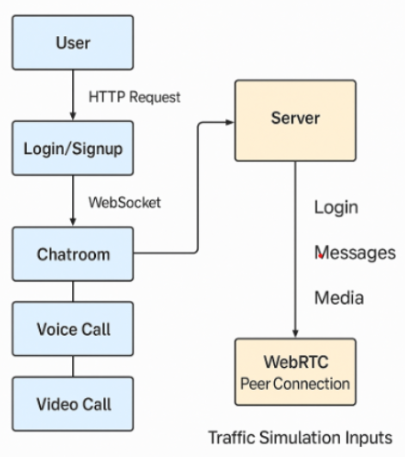

# Cancer Patient Support Chat Tool (CN Component)
**Please go to this link: https://oncolink-comms.onrender.com**
to login as a patient, enter one of the 2 credential: patient1@example.com, password: patient123 or patient2@example.com and patient456
similarly for doctor: doctor1@example.com, password: doctor123 or doctor2@example.com and doctor456
This tool is part of a larger project to predict the efficacy of drugs for cancer and to support patients by providing a safe, private space for communication and community building. The CN component focuses on real-time text and video chat for patients, helping them avoid isolation and interact with peers outside of mainstream media.

## Application Screenshots

### 1. System Flow

*Overview of the application's architecture and data flow between components.*

### 2. Doctor Dashboard

*Doctor's interface showing patient list and chat functionality.*

### 3. Document Upload

*Secure document upload interface for medical records and reports.*

### 4. File Upload Interface

*User interface for uploading files to the system.*

### 5. Secure Text Chat

*Secure messaging with end-to-end encryption for private conversations.*

### 6. MongoDB Database

*Screenshot showing the MongoDB database structure and collections.*

### 7. Cloudinary Integration

*Cloudinary dashboard showing stored media files and assets.*

### 8. User Authentication

*Secure login interface for patients and doctors.*

## Real-time Communication Features

### Voice Call
- **High-Quality Audio**: Crystal clear voice communication using WebRTC's audio streaming capabilities
- **Secure Connection**: End-to-end encrypted voice data transmission for patient confidentiality
- **Simple Interface**: Easy-to-use controls for muting/unmuting your microphone
- **Call Logging**: All voice calls are logged with timestamps for record-keeping
- **Cross-Device Compatibility**: Works seamlessly across different devices and browsers

### Video Call
- **Face-to-Face Interaction**: High-definition video calling for personal consultations
- **Privacy-First**: Encrypted video streams that ensure only intended participants can access the call
- **Media Controls**: Options to toggle video and audio on/off during calls
- **Screen Sharing**: Share your screen for better explanation of medical conditions or test results
- **Adaptive Bitrate**: Automatically adjusts video quality based on network conditions
- **Multiple Participants**: Support for group video consultations with multiple participants

Both voice and video calls are built on WebRTC technology, ensuring:
- Peer-to-peer connection when possible for lowest latency
- STUN/TURN server support for reliable connectivity behind NATs
- ICE (Interactive Connectivity Establishment) for optimal connection paths
- SRTP (Secure Real-time Transport Protocol) for media encryption

## Key Features and Advantages

1. **Privacy-Focused, Non-Mainstream Platform**  
   Designed specifically for cancer patients, providing a safe, private space away from mainstream social media, reducing exposure to misinformation, harassment, or unwanted attention.

2. **Real-Time Communication Using WebRTC**  
   - Utilizes WebRTC (Web Real-Time Communication) for peer-to-peer video and audio calls, ensuring low-latency, high-quality interactions without routing media through a central server.
   - WebRTC encrypts all media streams end-to-end (SRTP), so video and audio cannot be intercepted by intermediaries, enhancing patient privacy and data security.

3. **No Persistent Data Storage**  
   - Chat messages and video streams are not stored on the server, reducing the risk of data breaches and ensuring that sensitive patient conversations remain confidential and ephemeral.

4. **Minimal User Data Collection**  
   - Only usernames and session times are temporarily tracked for the purpose of displaying participants, with no requirement for personal information, email, or phone numbers.

5. **Open, Transparent Codebase**  
   - Built using open-source technologies (Node.js, Socket.IO, WebRTC), allowing for code audits and transparency, which is important for research and healthcare applications.

6. **User Empowerment and Control**  
   - Users can mute/unmute their microphone and turn their camera on/off at any time, giving them full control over their participation and privacy.
   - The interface clearly shows who is present in the chat, with join times, fostering a sense of community and trust.

7. **Protection Against Common Web Threats**  
   - All user-generated content is sanitized before display, preventing cross-site scripting (XSS) attacks.
   - No file uploads or external links are allowed in chat, reducing the risk of malware or phishing.

8. **No Third-Party Tracking or Ads**  
   - The platform does not use third-party analytics, cookies, or advertising, ensuring that patient data is not monetized or shared with external entities.

9. **Accessibility and Ease of Use**  
   - The interface is simple, intuitive, and accessible, lowering the barrier for patients who may not be tech-savvy or who are experiencing treatment side effects.

10. **Research and Clinical Integration**  
    - The tool can be integrated into broader research or clinical workflows, providing a secure channel for patient support, group therapy, or remote check-ins.

## Security and Suitability for Patients

- **WebRTC's End-to-End Encryption:** Unlike many mainstream platforms, WebRTC ensures that only the participants in a call can access the audio/video streams.
- **No Centralized Media Storage:** Media is not stored or processed on a central server, reducing attack surfaces and regulatory burdens (e.g., HIPAA/GDPR).
- **Custom-Built for the Community:** The system is tailored for the needs of cancer patients, avoiding the distractions, risks, and privacy issues of general-purpose social media.
- **Open Source and Auditable:** Researchers and clinicians can verify the security and privacy properties of the system.

---

This CN component is a step toward safer, more supportive digital spaces for cancer patients, empowering them to connect and share in a secure, research-driven environment.
